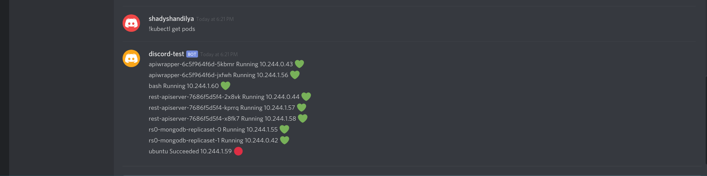

# Discord-Kubernetes-Bot

- The bot gives staus of your kubernetes cluster.
- Idea is to only be able to make effective api commands that allows READ operations on the cluster.
- Currently only trying to implement
    - 'kubectl get <resource> -n <namespace>'
    - Overall health status of cluster i.e. in a supported markdown format.  Currnet markdown is umm, well not apt for being called markdown in discord.  So using smileys for statuses
    - Format
    
    
    

    

## TODO
- Deisgn in a way that bot takes commands in same way as kubectl on command line works.
- Mapping of kubectl commands to API.